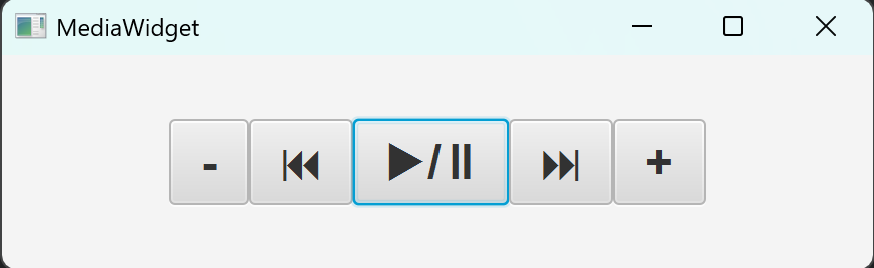

# Media Widget
A small window that makes system calls to the OS level media player, mimicking media keys that are found on some keyboards (play/pause, previous, next, volume).

Java's Robot library cannot mimic these keys, so platform-specific code is required. Currently, only Windows is supported (Win32 API). The MediaSystemCaller interface provides a layer of abstraction, so that Linux and macOS support can be added later.

This widget should prove useful for keyboards without media keys.

## Architecture

The following list is the project architecture, listed from frontend to backend.

- JavaFX FMXL

- View Controller

- ViewModel

- Model (MediaSystemCaller)

- Platform-Specific Implementations